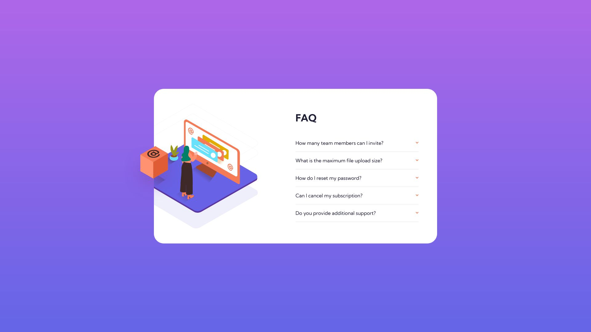

# Frontend Mentor - FAQ accordion card solution

This is a solution to the [FAQ accordion card challenge on Frontend Mentor](https://www.frontendmentor.io/challenges/faq-accordion-card-XlyjD0Oam). Frontend Mentor challenges help you improve your coding skills by building realistic projects.

## Table of contents

- [Overview](#overview)
  - [Screenshot](#screenshot)
  - [Links](#links)
- [My process](#my-process)
  - [Built with](#built-with)
  - [What I learned](#what-i-learned)
- [Author](#author)

## Overview

Hi! This is my attempt at the FAQ accordion component. For this particular challenge, I decided to work in reverse to my usual approach, which meant getting the structure, layout and functionality of the accordion completed first before moving on to styling the rest of the card.

Arranging the images on the left side of the card proved to be much more challenging compared to the accordion itself.

### Screenshot

Desktop

Mobile

### Links

- Solution URL: [Here!](https://github.com/sheronimo/frontendmentor-faqaccordion)
- Live Site URL: [Here!](https://sheronimo.github.io/frontendmentor-faqaccordion/)

## My process

1. I restructured the markup for the outer card container and the accordion, dividing each accordion into a head and body.
2. I added some base styling (spacing, font size) to the accordion before working on the Javascript for expanding and collapsing the accordion.
3. Only after completing the functionality did I then move on to fine-tune the various spacing properties of the accordion.
4. I then worked on the rest of the card.

### Built with

- SASS
- Flexbox
- Grid
- Javascript (event listeners)

### What I learned

I learned about how to work with accordions as a whole without using any framework such as Bootstrap, including using transitions to animate the expanding and collapsing of the body of text.

## Author

- Github - [sheronimo](https://github.com/sheronimo)
- Frontend Mentor - [@sheronimo](https://www.frontendmentor.io/profile/sheronimo)
